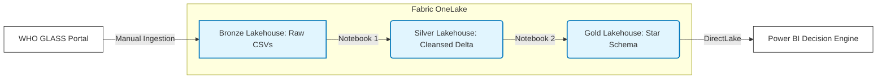

# GLASS-AMR-Data-Engine-End-to-End-WHO-Surveillance-Pipeline-in-Microsoft-Fabric
This project engineers a fully automated, end-to-end data analytics platform in Microsoft Fabric to procness, model, and visualize global Antimicrobial Resistance (AMR) data. By bridgig Data Engineering with Microbiological domain logic, this pipeline transforms raw, disjointed surveillance datasets into a bias-adjusted Decision Intelligence engine
