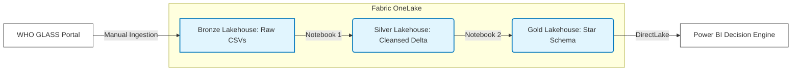

# GLASS-AMR-Data-Engine-End-to-End-WHO-Surveillance-Pipeline-in-Microsoft-Fabric

## Project Overview
This project engineers a fully automated, end-to-end data analytics platform in Microsoft Fabric to process, model, and visualise global Antimicrobial Resistance (AMR) data. By bridging Data Engineering with Microbiological domain logic, this pipeline transforms raw, disjointed surveillance datasets into a bias-adjusted Decision Intelligence engine.

## The Data Source & Representation
The data is sourced from the **World Health Organization's GLASS (Global Antimicrobial Resistance and Use Surveillance System)** platform (2019–2023).

**System Capacity**: Tracks national enrollment vs. active reporting of National Reference Labs (NRLs) and Quality Assurance metrics.

**Coverage & Volume**: Represents testing density via Blood Culture Isolates (BCIs) per million population, and AST (Antimicrobial Susceptibility Testing) completeness.

**Pathogen & Resistance Signals**: Tracks specific priority pathogens (e.g., *E. coli, S. aureus, K. pneumoniae*) across specific infection types (Bloodstream, Gastrointestinal, etc.), plotting the distribution (Min, Q1, Median, Q3, Max) of resistance rates to specific antibiotic classes.

## What this Project Digs Up (The Intelligence)
Standard global averages in AMR can be dangerously misleading if the underlying laboratory capacity is weak. This project is therefore built to uncover three critical insights:

**1. Surveillance Blind Spots**:  Identifying countries enrolled in the program but failing to report high-quality AST (Antimicrobial Susceptibility Testing) data.

**2. Bias-Adjusted Resistance Trends**: Dynamically masking alarming resistance spikes if the reporting country lacks the testing density to make the data statistically reliable. 
**3. Global Pathogen Profiles**: Ranking the sheer volume of infectious agents (e.g., *E. coli, S. aureus*) actively evading antibiotic treatments globally.

## The Domain Challenge: Why this isn't a standard ETL project
Analysing global AMR data requires handling a critical **granularity mismatch**. 
Standard global averages in AMR can be dangerously misleading if the underlying laboratory capacity is weak. A 90% resistance rate to Penicillins in a country testing 5 patients means something entirely different than a 15% rate in a country testing 50,000 patients

## Tech Stack
* **Storage & Compute:** Microsoft Fabric, OneLake
* **Data Engineering (ETL):** Apache Spark (PySpark), Delta Parquet
* **Data Modeling:** Dimensional Modeling (Star Schema), DirectLake
* **Analytics & UI:** Power BI, DAX (Data Analysis Expressions)
  
## Project Steps Overview
1. Architecture & Data Acquisition (Downloads & Bronze Layer)
2. The Silver Layer (Data Cleansing & Unpivoting with PySpark)
3. The Gold Layer (Dimensional Modeling & Star Schema)
4. The Intelligence Engine (DAX & Power BI Dashboard)
5. Automation (Fabric Pipelines)

## How to Navigate this Repository
* **`steps.md`**: A detailed, step-by-step walkthrough of the pipeline construction, from raw ingestion to the final automated trigger (for future automated data ingestion and processing).
* **`src/`**: Contains the PySpark notebooks and DAX code used in the Semantic Model.
