# Pipeline Construction Steps

## Phase 1: Data Acquisition & The Bronze Layer

### 1.1 Sourcing the WHO Microbiological Data
The foundation of this platform is the World Health Organization's GLASS IT Platform [Global AMR Data](https://worldhealthorg.shinyapps.io/glass-dashboard/_w_bdbddcd5c5c24ac98d7fb1d57054709a/#!/amr). Unlike modern APIs, global health surveillance data at this scale is often released as static, complex CSV exports. 

I extracted the annual datasets for 2019–2023, specifically targeting three core microbiological and infrastructural domains:
* **System Capacity:** Tracks which countries have the laboratory infrastructure and Quality Assurance (QA) protocols required to identify pathogens accurately.
* **Surveillance Coverage:** Tracks the volume of Blood Culture Isolates (BCIs) and the percentage of isolates that underwent Antimicrobial Susceptibility Testing (AST).
* **Pathogen Resistance Rates:** Contains the statistical distribution (Min, Median, Max) of resistance for priority microbe-drug combinations (e.g., *K. pneumoniae* vs. Meropenem).

### 1.2 Provisioning the Fabric Architecture
In Microsoft Fabric (`Global AMR Surveillance` Workspace), I established a strict Medallion Architecture to decouple raw storage from business logic. I provisioned three distinct Lakehouses:
1. `AMR_Bronze` (Raw, immutable CSVs)
2. `AMR_Silver` (Cleansed, unpivoted Delta Parquet tables)
3. `AMR_Gold` (Dimensional Star Schema for Power BI DirectLake)

### 1.3 Ingesting into OneLake (The Bronze Landing Zone)
Data engineering best practices dictate that the Bronze layer must represent the exact, unaltered state of the source system. 

I mapped the local files directly to the `AMR_Bronze` Lakehouse. Under the OneLake `Files` directory, I created a structured landing zone (`Files/Bronze_Landing/`) and ingested all 30+ disjointed CSV files. 

**Architectural Decision:** *Why keep them as raw CSVs instead of immediately converting to Delta tables?* By keeping the Bronze layer in its native format, I get to preserve a cryptographically auditable "source of truth." If a downstream PySpark transformation fails or business logic changes, I can instantly replay the pipeline from these original files without needing to re-extract from the WHO portal.

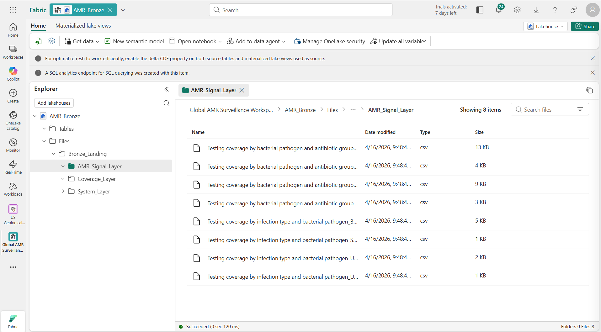

---

## Phase 2: The Silver Layer (Data Cleansing & Transformation)
**The Challenge:** The WHO CSVs were riddled with dirty metadata headers, null values, and complex stacked tables that Power BI cannot natively read.

### 2.1 The Challenge with Raw WHO Data
Directly connecting Power BI to the Bronze CSVs would be a disaster. The raw data contains:
* **Inconsistent Schemas:** Blank cells instead of explicit `0`s/`NULLS` (which breaks DAX math).
* **Pivoted Formats:** The System Capacity data is wide (years as columns) instead of long, making it impossible to filter effectively.
* **Corrupt Data Types:** Integer columns (like total tested isolates) are often read as Strings due to trailing spaces or "-" characters representing nulls.

### 2.2 The PySpark Solution
I deployed a PySpark notebook (`01_Bronze_to_Silver.py`) attached to the `AMR_Silver` Lakehouse to enforce schema-on-read and transform the raw CSVs into highly optimized **Delta Parquet** tables. 

**Key Transformations:**
1. **Header Normalization:** Stripped special characters and spaces from all column names.
2. **Null Imputation:** Replaced missing integer counts with `nulls` to prevent DAX calculation failures downstream on numerical observation columns (like `TotalSpecimenIsolates`).
3. **Unpivoting (Melting) Wide Data:** Utilized a "Gaps and Islands" forward-fill algorithm using PySpark Window functions to unpivot the stacked System Capacity indicators file, turning a static report into an analysable table.

### 2.3 Writing to Delta
I wrote the cleansed DataFrames back to OneLake using the Delta format . This gives us ACID transactions, time travel, and predicate pushdown—meaning Power BI will eventually query this data exponentially faster than raw CSVs.

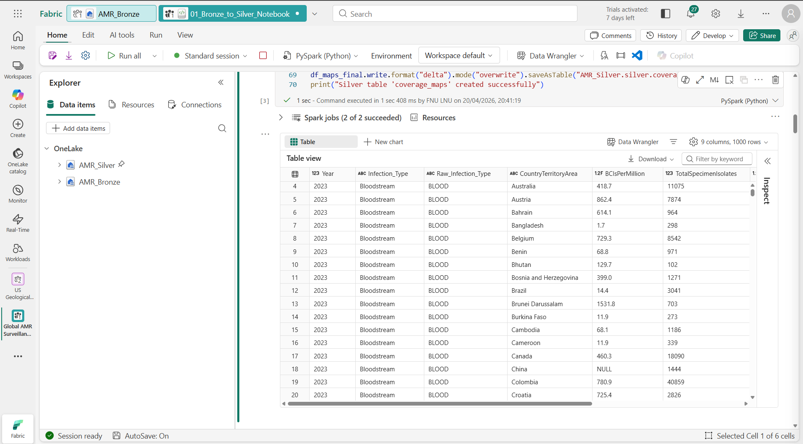
>*[Executing the PySpark transformation in the Fabric Notebook, writing clean Delta tables to the Silver Lakehouse.]*

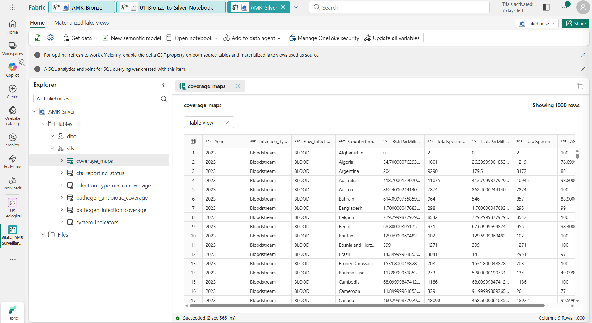

---

## Phase 3: The Gold Layer (Dimensional Modeling & Star Schema)
**The Challenge:** Connecting country-level coverage data with global-level pathogen data requires a strict Star Schema to avoid Cartesian products and ambiguous filter contexts.

**The Process:**
Created `AMR_Gold` Lakehouse with a secondary PySpark notebook (`02_Silver_to_Gold.py`).
* Generated Surrogate Keys (IDs) for 5 Dimension tables (`dim_geography`, `dim_pathogen`, `dim_antibiotic`, `dim_infection`, `dim_year`).
* Built 4 Fact tables, utilizing PySpark `join` operations to replace raw string values with the optimized integer IDs.
* Filtered all data to a strict 2019-2023 window.

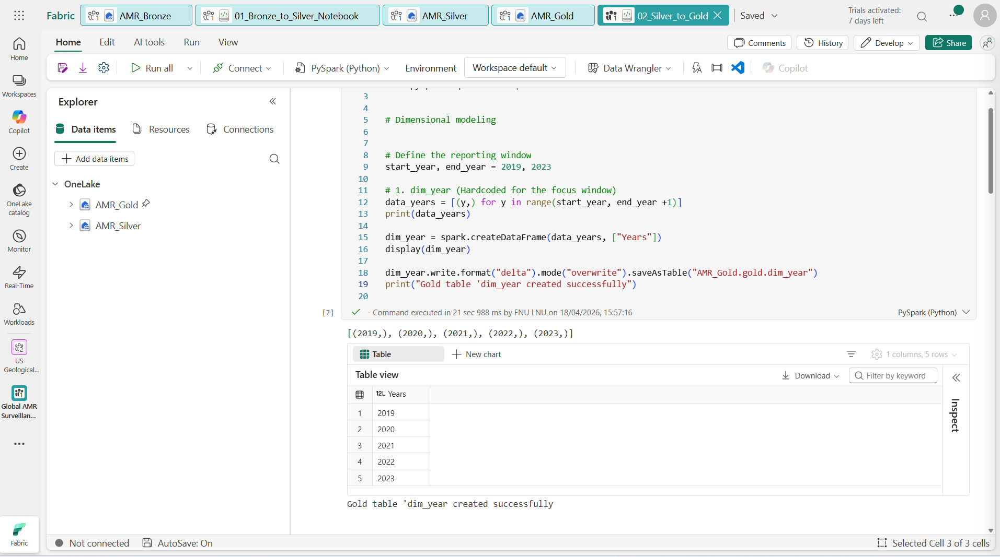

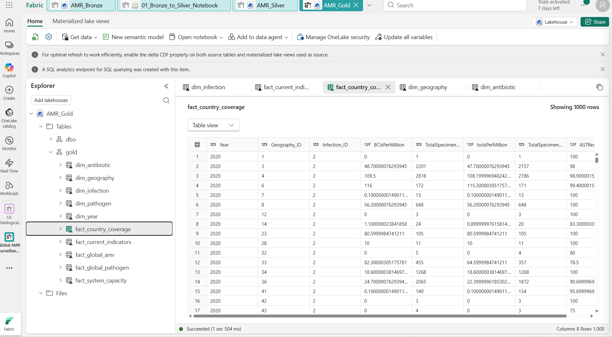

### 3.1 The Semantic Challenge
Connecting the Silver data directly to Power BI would create a nightmare of many-to-many relationships and Cartesian products. The country-level reporting metrics live in one table, and pathogen-level resistance metrics live in another. If a user clicks "2023" on a dashboard, I need a unified data model that accurately filters both simultaneously.

### 3.2 Building the Star Schema (PySpark)
To resolve this, I utilised a second PySpark notebook (`02_Silver_to_Gold.py`) to engineer a Star Schema. This transforms the flat Silver tables into highly optimised Fact and Dimension tables.

**1. Dimension Tables (The Context):**
I extracted unique values to create centralized lookup tables, assigning an integer Surrogate Key to each. e.g
* `dim_geography`: Maps country names.
* `dim_pathogen`: Catalogs the priority bacteria (e.g., *K. pneumoniae*, *S. aureus*).
* `dim_antibiotic`: Catalogs the tested drug classes (e.g., Carbapenems, Penicillins).
* `dim_year`: A standard year table to control all time-series DAX intelligence.

**2. Fact Tables (The Metrics):**
I joined our Silver data against these new Dimensions, dropping the heavy string columns (like the full names of pathogens or countries) and replacing them with lightweight integer IDs. 
* `fact_country_coverage`: Stores the volume of testing (BCIs) and AST completeness percentages.
* `fact_global_resistance`: Stores the distribution math (Min, Median, Max) for specific bacteria/drug combinations.

### 3.3 DirectLake Integration
By writing these final Gold tables back to OneLake as Delta Parquet files, I unlocked **Microsoft Fabric's DirectLake mode**. Power BI can now query these Parquet files directly in memory. There is no traditional data import, no semantic model refresh limits, and zero latency between the PySpark ETL finishing and the dashboard updating.

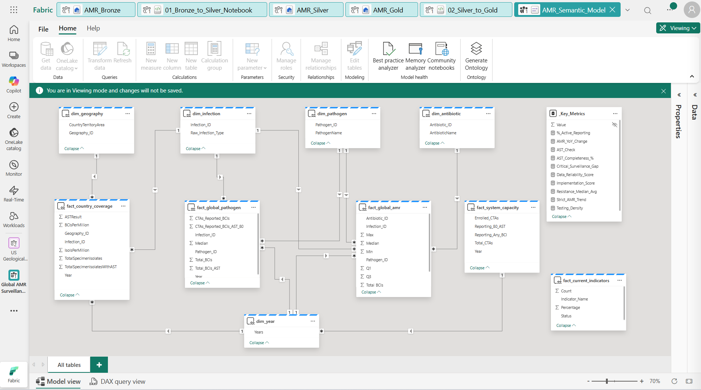

> *[The final Gold Star Schema in Power BI's Model View, showing clean 1-to-Many relationships flowing from Dimensions to Facts.]*
---

## Phase 4: The Intelligence Engine (DAX & Semantic Model)
*(Reference Code: `src/DAX_Measures.dax`)*
Because the Gold layer resides in Fabric, I utilized **DirectLake** to connect Power BI directly to the Parquet files in memory, resulting in zero-import refresh times.

The core challenge of this dashboard was adjusting for reporting bias. I engineered a robust DAX engine to handle this dynamically.

**1. The Data Reliability Score:**
I built a weighted score (0-100) that evaluates a country's baseline testing density against the percentage of their isolates that underwent full Antimicrobial Susceptibility Testing (AST).

**2. The Bias-Adjusted Trendline:**
I created a dual-line system for the final UI:
* A raw global average (which is heavily skewed by a few wealthy nations reporting massive datasets).
* A `Strict_AMR_Trend` measure. This DAX formula checks the `Data_Reliability_Score`. If the score falls below 40%, the formula outputs `BLANK`, effectively masking the data point. This prevents a sudden drop in lab quality from appearing as a false spike in global resistance.

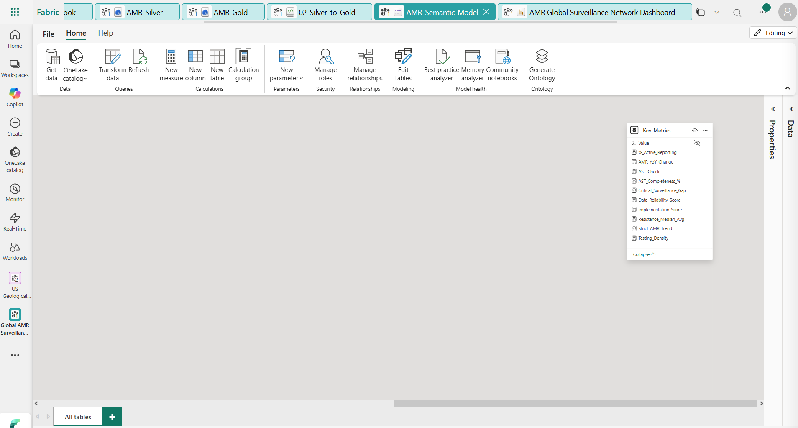

### Dashboard Deliverables:
The final UI consists of three interconnected pages:
1. **Global Overview:** Tracking testing density and active reporting rates.
   
   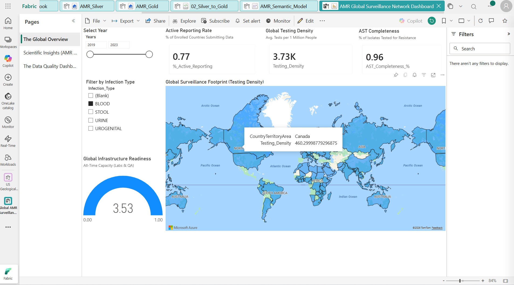
   
2. **Scientific Insights:** Tracking specific bacteria/drug resistance trends via heatmaps and masked line charts.
   
   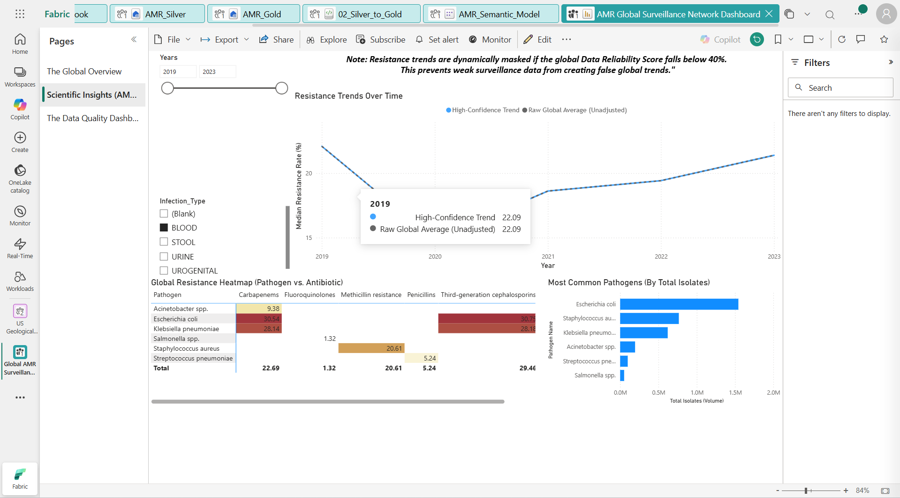
   > *[The Scientific Insights page. Note the dual trendlines, allowing policy-makers to separate genuine resistance spikes from data artifacts.]*
   
3. **Data Quality & Gap Detection:** A dynamic map and funnel identifying which regions are failing to report actionable intelligence.
   
   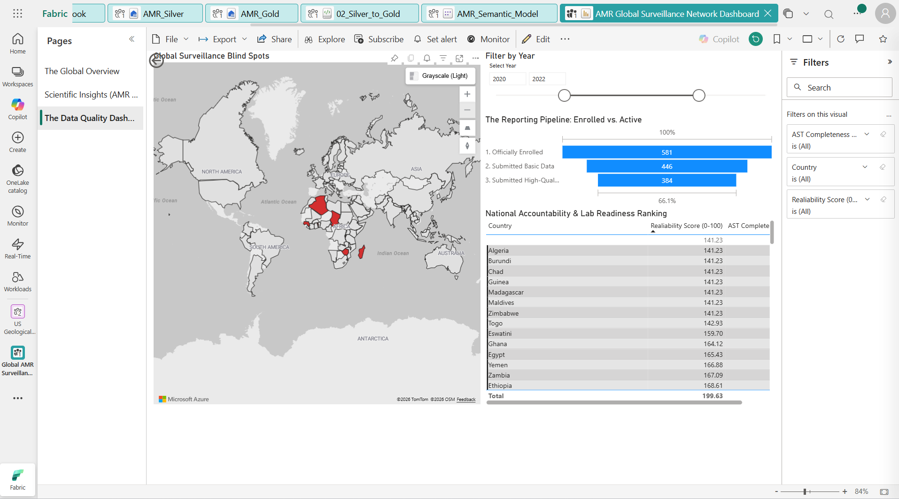

---

## Phase 5: Pipeline Automation
*(Reference: Fabric UI)*

To remove manual intervention for future WHO data releases, I orchestrated a **Fabric Data Pipeline**. 

When a new year of data is dropped into the `Bronze_Landing` folder, the pipeline executes sequentially:
1. Triggers the `01_Bronze_to_Silver` notebook.
2. Upon verified success, triggers the `02_Silver_to_Gold` notebook.
3. Because of DirectLake, the Power BI semantic model updates instantly upon the Gold layer's completion.

This architecture reduces the time-to-insight from weeks (manual Excel manipulation) to minutes.

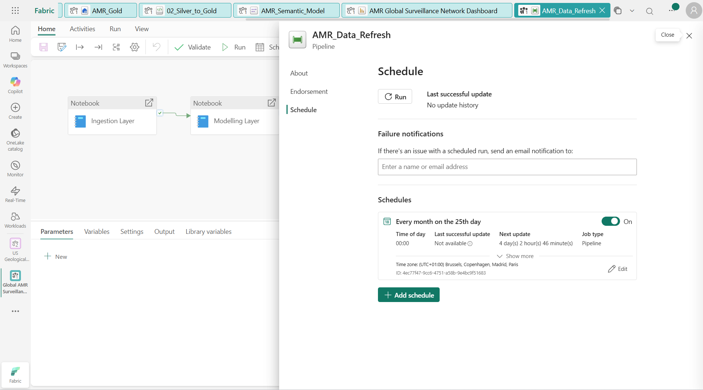
> *[The automated Fabric pipeline orchestrating the PySpark ETL and modeling.]*
---

